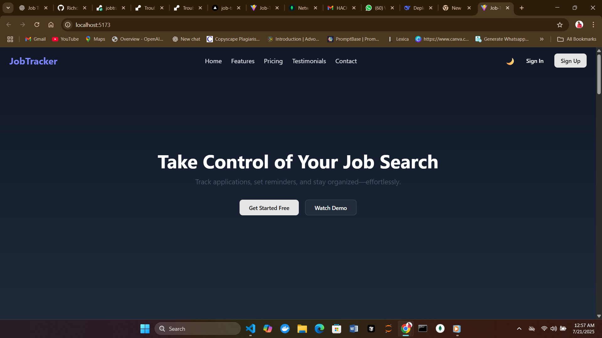
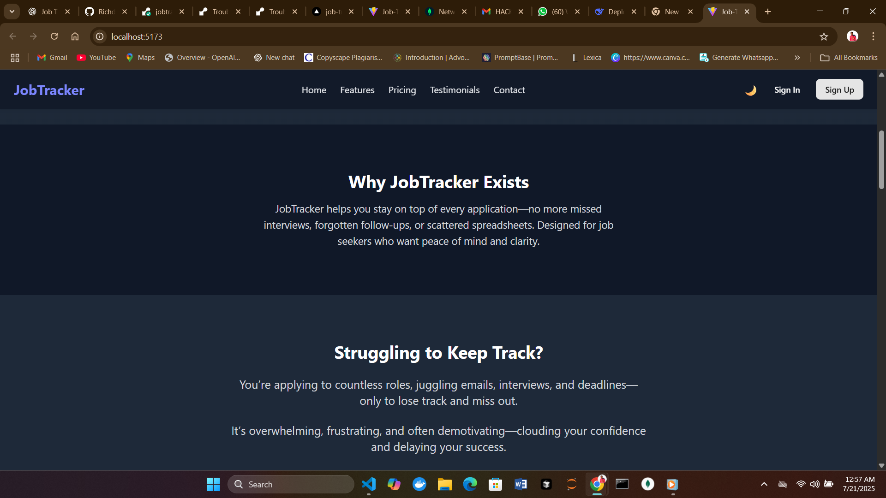

# Job Tracker App (MERN Stack)

A full-featured job application tracking system that allows users to monitor their job applications, receive interview reminders, and manage their job-seeking process in one place.

## 🌟 Features

- 🚀 User Signup/Login (JWT Authentication)
- 🧑‍💻 Add, Edit, and Delete Job Applications
- 📊 Personalized User Dashboard
- 📬 Email Reminders for Scheduled Interviews
- 🌙 Light/Dark Mode Toggle
- 📱 Responsive UI (TailwindCSS 4.1 + shadcn)
- 🛡️ Admin Dashboard to Manage Users
- 📁 Clean Code Architecture (Frontend + Backend)
- 📦 Postman Collection Included for API Testing

---

## 🛠 Tech Stack

- **Frontend**: React.js, Tailwind CSS 4.1, shadcn, React Router DOM
- **Backend**: Node.js, Express.js, MongoDB, Mongoose, JWT
- **Email**: Nodemailer for interview reminders
- **Authentication**: JWT-based session management

---

## 📁 Folder Structure

```bash
job-tracker-app/
├── client/                  # React frontend
│   ├── src/
│   │   ├── components/      # Reusable components (Navbar, Footer, Forms)
│   │   ├── pages/           # Pages (Login, Dashboard, etc.)
│   │   ├── App.jsx
│   │   └── main.jsx
├── server/                  # Express backend
│   ├── controllers/
│   │   ├── userController.js
│   │   ├── adminController.js
│   │   └── jobController.js
│   ├── models/
│   │   ├── userModel.js
│   │   └── jobModel.js
│   ├── routes/
│   │   ├── userRoutes.js
│   │   ├── adminRoutes.js
│   │   └── jobRoutes.js
│   ├── middleware/
│   │   ├── authMiddleware.js
│   │   └── errorHandler.js
│   ├── utils/
│   │   └── sendEmail.js
│   ├── config/
│   │   └── db.js
│   ├── server.js
│   └── .env

```

## 🚀 Getting Started
### 1. Clone the Repository
```
bash

git clone https://github.com/yourusername/job-tracker-app.git
cd job-tracker-app
```
### 2. Install Dependencies

**Backend:**
```
bash

cd server
npm install
```
**Frontend:**
```
bash

cd client
npm install
```
### 3. Run the App

**Backend:**
```
bash

npm run dev
```
**Frontend:**
```
bash

npm run dev
```
App will be running at: http://localhost:5173

---

## 🔐 Authentication
- JWT token is generated on login/signup.

- The token is stored in localStorage.

- Protected routes redirect unauthenticated users.

---

## 📩 Email Interview Reminders
- Users can schedule interviews with a date/time.

- The app sends an email reminder using NodeMailer.

- Email config must be correctly set in .env.

---

## 📬 Postman API Testing
- Import JobTracker.postman_collection.json into Postman.

- Test routes for: register, login, add/edit job, get jobs, and email notifications.

---

## ✨ UI Design
- TailwindCSS 4.1 for clean and modern styles

- shadcn components for UI consistency

- Dark mode toggle supported

---

## ✍️ Future Improvements

- **Notifications with browser alerts**

- **Job search integration** (e.g., LinkedIn API)

- **PDF export of tracked jobs**

- **Mobile App version**

---

## 🛡 Admin Features
- **View all users and jobs**

- **Delete inappropriate or inactive users**

- **Analytics dashboard**

---

## Live URL:
- Live Demo: https://job-tracker-one-chi.vercel.app/signup

---

## Video Link:

---

## 👨‍💻 Author
- **Richard Akintunde**

- **Email: akintunderichard28@gmail.com**

- **GitHub: @richdigital2021**

---

## 📸 Screenshots

<div align="center">
  
  
</div>


---

## 🤝 Contributing
**1. Fork the repo**

**2. Create your feature branch (git checkout -b feature/feature-name)**

**3. Commit your changes (git commit -m 'Add feature')**

**4. Push to the branch (git push origin feature/feature-name)**

**5. Open a pull request**

---

## 📄 License
**MIT License**

---

## 💡 Inspiration
Helping job seekers stay organized and motivated through a simple and effective dashboard

